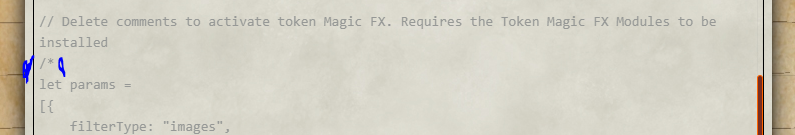
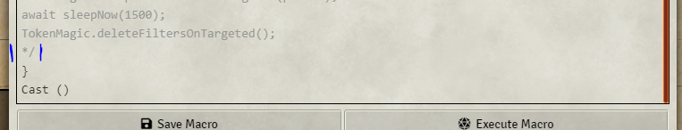
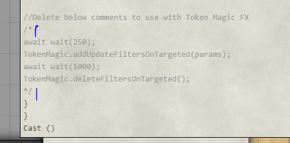
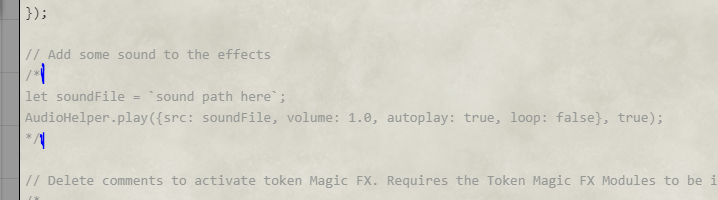
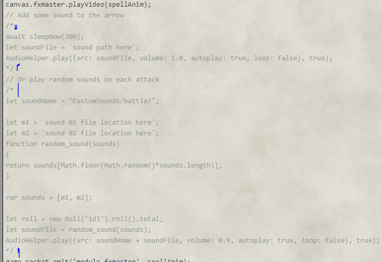

## UPDATE NOTES
0.0.3
1. Fixed a mistake in some of the macros where a line of code was ommited that played the animations on all clients. This is fixed in 0.0.3.
  Unfortunately, this means if you've imported alot of these macros into your world you will need to do 1 of 2 things to fix:
  a. Delete the in-world macro and reimport from the compendium
  b. Copy paste all the update macro into the already imported one
  
  Appologies for the inconvenience to those who have already imported these and done customization. But if this is the case, let me know and I can show you the code I fixed and you can just add it to your existing macros.

2. Also, I noticed an issue I failed to test with the Token Magic FX code in these macros. You will need to enable the "Permissive Mode" in the TMFX Module settings. This enables players to apply TMFX filters

3. Witchbolt macros have been updated for better implementation of loops

# otigons-animation-macros
This is a collection of Macros I've made for use with the JB2A Animations Patreon Module. These are based on the D&D 5e system, but can be used for other systems as well.

Credit goes to the following for helping with many of these:
- JB2A (check them out on Patreon: https://www.patreon.com/JB2A )
- Kandashi (Check out Kandashi's highly effective modules such as Next Up, DAE SRD, Active Auras, and more!. (https://www.patreon.com/Kandashi)
- Lazytron
- Crymic (Check out some incredible macros https://www.patreon.com/crymic)
- Freeze
- Enso
- FXMaster
- and many others

# Installation
Currently this will only be availble thru manual installation. I have no current plans to issue this through Foundry

To install this module manually: 

1. Inside the Foundry "Configuration and Setup" screen, click "Add-on Modules"
2. Click "Install Module"
3. In the "Manifest URL" field (bottom) paste the following url: https://github.com/otigon/otigons-animation-macros/releases/latest/download/module.json
4. Click "Install" and wait for installation to complete
5. Don't forget to enable the module in game using the "Manage Module" button

## About the Macros
99% of these macros will function with just **Midi-Qol**, **JB2A Patreon module** and **FXMaster**. The Furnace is suggested, and I will be uploading a new compendium in the following week that utilizes Midi-Qol automation to help run the animations.

The Compendiums in this module are separated as such:
1. Spell Animations
2. Ranged Weapon Attacks
3. Melee Weapon Attacks
4. Explosions
5. Miscellaneous

These are all written for the Patreon version of JB2A. To use with the Free module version, you'll need to edit the macro to point to the correct folders. Usually this is written like:

let file = "modules/jb2a_patreon/......

Just change the jb2a_patreon to the file name for the free version and you're good to go

## Fun Add-Ons

For further fun I have added the following to all of the macros:
**NOTE**: THESE ARE INACTIVE (commented out) and will need to be activated to use

1. Audio: Each has a section to add an audio path and file to play a sound effect along with the animation. Some even have a randomizing audio call to switch up the sounds.

2. Token Magic FX: I have added in some fun Token Magic FX (requires module) that can be activated to give more 'oomph' to the effects. I left these inactive for now, but may activate them on a later release depending on feedback. They really are fun!

## How to Use these Macros

Most every macro can be used without attaching it to an item/spell. They can sit in the macro bar and be used at-will.
For use in conjuction with an item/spell, instructions are as follows:

Bare Minimum Instructions for use:
**NOTE** 1st check out the Tutorial video by JB2A that gives a good run down of how to use these types of macros: https://www.youtube.com/watch?v=264xZJjPHD8 

1. In the Midi-Qol workflow settings, at the very bottom, is a check box for "Add macro to call on use". Ensure this is checked

2. This activates a new fillable field "One Use Macro" in the item/spell details page, also at the bottom.

3. Import whichever macro you would like to use into your world.

4. Add the name of the macro you would like to use in the "On Use Macro" field. This MUST match exactly the name of the macro (case sensitive). I suggest copy/pasting from the macro to ensure no errors are made.

Now you're ready to go!

Whenver you use the item/spell, it will call the macro once the damage is rolled. **For 99% of these, you will need to have a target(s) Targeted, and the casting/hitting token Selected**. Some have options to play the animation on the "selected" token instead of the targeted token, such as the Explosions in the Explosions Compendium.

## How to Activate Sounds or TMFX codes

In progress

In almost every macro there is a section for adding Token Magic FX. This is noted at the start of the inactive code by something like: Delete comments to activate Token Magic FX code. This does requires the TMFX module to be installed and activated.

**NOTE** You will need to enable "Permissive Mode" from the Token Magic FX module settings to allow players to apply the TMFX filters

To activate the code, delete the /\*  at the start of the code, and then the \*/ at the end.
For example you would delete the start of the comment out:

Next you need to look for the end comment after the TMFX Code and delete that as well

A few macros also have additional inactive code at the end that will need to be activated for TMFX. This will remove the effects after a duration

#### SOUNDS

To activate sounds, find the sound section in the code. This is usually before the Token Magic FX code. Activate by removing the comment marks as described above.

Also, some have an option to use multiple sounds to randomize what is played each time the item is rolled:

